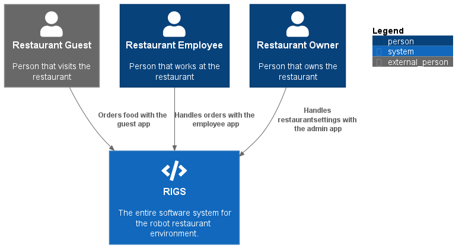
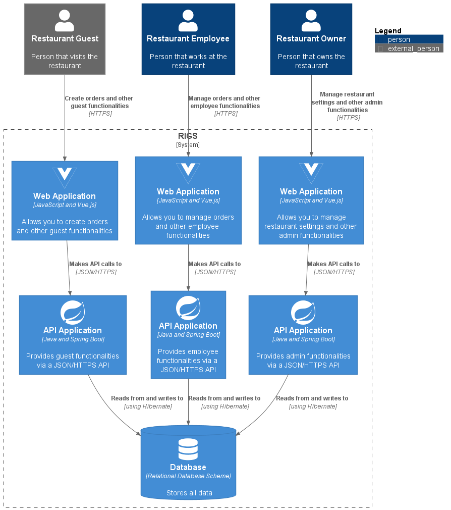

### De RIGS bestel applicatie heeft drie gebruikers groepen

### Elke gebruikers groep heeft zijn eigen front/back-end

1. Admin applicatie: Hier stelt de restauranteigenaar het menu in.
2. Klant applicatie: Hier besteld de klant zijn eten
3. Medewerker applicatie: Hier komen de bestellingen van de klant binnen zodat de keuken kan beginnen met de bereiding.
      Deze drie projecten communiceren doormiddel van een gedeelde database. Hiervoor is een database library gemaakt om conflicten te voorkomen.

In deze git repo vind je de eerste van de drie applicaties. Deze is weer opgesplitst is twee sub applicaties:
1.	Front-end: Hiervoor is het Vue framework (JavaScript) gebruikt.
2.	Backend: Hiervoor is het Spring framework (Java) gebruikt.
      Opstarten van de applicaties:
      Voor een uitleg voor het opstarten van deze applicaties ga naar de readme files in deze folders:
1.	frontend/admin-app-frontend/ - Voor de frontend
2.	backend/admin-app-backend/ - Voor de backend

OpenAPI Documentation: `/v3/api-docs`

Swagger: `/swagger-ui`

In the config file of the MySQL Server, change max_allowed_packet from 1M to 10M to allow base64 images of greater scales.
Only change the max_allowed_packet of the server settings, not the UTF-8 settings.

# Docker Deployment
## Front-end Dockerfile 

In de front-end applicatie is een Dockfile met de configuratie om de applicatie in een docker container te draaien. Belangrijk hierbij is dat in de Dockerfile staat dat de applicatie op port 8081 zal gaan luisteren op inkomende verzoeken als er in de package.json bestand een andere port wordt aangegeven dan moet diezelfde poort ook in de Dockerfile komen te staan anders zal de applicatie niet bereikbaar zijn. 

Voor de rest zorgt de Dockerfile er voor dat de applicatie gebouwd wordt voor productie. 

Om de een docker image te maken voor het front-end moet je eerst Docker installeren, dat kan [hier](https://docs.docker.com/get-docker/). 

Als docker geïnstalleerd is voer je de volgende commando uit in een terminal/CMD in de root folder van het project waar de Dockerfile zich bevindt. 

Commando: docker build -t rigs-front-end . 

De naam rigs-front-end kan veranderd woorden naar iets anders 

LET OP DE PUNT OP HET EINDE IS HEEL BELANGRIJK ANDERS WORD DE IMAGE NIET GEMAAKT!.  

## Backend Dockerfile 

In de backend applicatie is een Dockfile met de configuratie om de applicatie in een docker container te draaien. Belangrijk hierbij is dat in de Dockerfile staat dat de applicatie op port 8080 zal gaan luisteren op inkomende verzoeken als een andere port wordt aangegeven dan moet diezelfde poort ook in de Dockerfile komen te staan anders zal de applicatie niet bereikbaar zijn. 

Voor de rest zorgt de Dockerfile er voor dat de applicatie gebouwd wordt voor productie. 

Om de een docker image te maken voor het front-end moet je eerst Docker installeren, dat kan [hier](https://docs.docker.com/get-docker/). 

Als docker geïnstalleerd is voer je de volgende commando uit in een terminal/CMD in de root folder van het project waar de Dockerfile zich bevindt. 

Commando: docker build -t rigs-backend . 

De naam rigs-backend kan veranderd woorden naar iets anders 

LET OP DE PUNT OP HET EINDE IS HEEL BELANGRIJK ANDERS WORD DE IMAGE NIET GEMAAKT!.  

# DockerCompose 

Om beide applicaties live te zetten en om er voor te zorgen dat ze met elkaar kunnen communiceren is er gebruik gemaakt van een docker-compose.yml bestand in de root van het project. Niet in de backend of front-end project maar waar beide projecten zitten. De docker-compose.yml zorgt ervoor dat beide applicaties worden gebouwd door op beide docker build -t [naam] . uit te voeren. 

[Download docker-compose](https://docs.docker.com/compose/install/)

In de docker-compose.yml wordt er gebruik gemaakt van een reverse proxy zodat beide applicaties hun eigen host hebben maar toch met elkaar kunnen communiceren. Om de docker-compose.yml uit te voeren moet je de volgende commando uitvoeren in een terminal/CMD. 

Commando: docker-compose up --build beide applicaties worden gebouwd en gestart.

# API Documentatie
De documentatie voor de api is
[hier](https://documenter.getpostman.com/view/13694729/UVXgMd6x#efb4951c-5b0d-4de8-81f5-a95c7b1bf6bc)